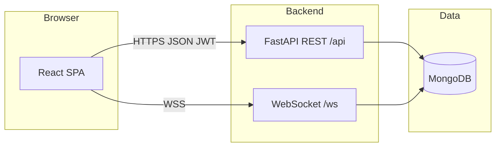

# Together & Go — Project Submission

**Document version:** 1.0  
**Date:** April 2026  

---

## 1. Problem statement

Students and staff often need to coordinate **shared travel** (carpools) and **small teams for events** (competitions, hackathons, registrations) within an institution. Informal coordination via chat groups is fragmented: requests get lost, there is no clear view of capacity or pending approvals, and there is no single place tied to official identity (e.g. registration numbers).

**Together & Go** addresses this by providing a **web application** where:

- Users authenticate with **institutional credentials** (registration number and password).
- **Administrators** can **bulk-import** students from a spreadsheet and manage accounts.
- **Students** can **create and discover** carpools (route, time, seats) and **event pools** (event details, team size, requirements).
- **Join flows** use **requests and accept/reject** by creators, with **notifications** when something relevant happens.
- **Group chat** and **real-time notifications** help members stay aligned without leaving the app.

The problem is therefore **coordination under identity, capacity, and approval constraints**, replacing ad-hoc messaging with a structured, auditable workflow.

---

## 2. User stories

| ID | As a … | I want to … | So that … |
|----|---------|-------------|-----------|
| US-1 | Student | Log in with my registration number and password | I can access features securely |
| US-2 | Student | Change my password after first login | My account meets policy and I control access |
| US-3 | Admin | Upload an Excel file of students (registration number, name) | Many accounts are created at once with default passwords |
| US-4 | Admin | View all registered users | I can verify onboarding and support users |
| US-5 | Admin | Reset a student’s password to the default | A user who forgot credentials can recover via admin |
| US-6 | Student | Create a carpool with source, destination, date/time, seats, notes | Others can find and request to join my ride |
| US-7 | Student | Browse carpools and request to join | I can share transport without private messaging only |
| US-8 | Carpool creator | Accept or reject join requests | Only trusted passengers are added within seat limits |
| US-9 | Student | Create an event pool (name, date, link, members needed, requirements) | I can form a team for an event |
| US-10 | Student | Request to join an event pool and get accepted/rejected | The group fills in a controlled way |
| US-11 | Member | Exchange messages in a carpool or event group | We can coordinate details in context |
| US-12 | User | Receive notifications (join requests, accept/reject, group full, deletions) | I do not miss important updates |
| US-13 | User | See notifications in the app and mark them read | I can triage what matters |
| US-14 | Carpool/event creator | Delete a group I created | Obsolete listings are removed and members are informed |

---

## 3. System architecture and system design

### 3.1 High-level architecture

The system follows a **client–server** model with a **single-page application (SPA)** front end and a **REST + WebSocket** back end, backed by a **document database**.



- **Frontend:** React (Create React App with CRACO), React Router, Axios for HTTP, native **WebSocket** for live updates, Tailwind-style UI components.
- **Backend:** **FastAPI** application exposing routes under `/api`, plus a **WebSocket** endpoint `/ws/{user_id}` for per-user push messages.
- **Data:** **MongoDB** accessed asynchronously via **Motor**; collections include users, carpools, event pools, messages, and notifications.

### 3.2 Authentication and security

- **JWT** bearer tokens (`Authorization: Bearer <token>`) are issued on successful login; protected routes use a dependency that validates the token and loads the user.
- Passwords are stored using **bcrypt** hashing (via passlib).
- **Role:** `is_admin` distinguishes admin vs student dashboards and gates admin-only endpoints.

### 3.3 Core domain design

- **Carpools** and **event pools** share a pattern: creator, members array, pending **requests** array, and metadata. Creators **accept** or **reject** requests; acceptance enforces **seat count** (carpool) or **members_needed** (event pool).
- **Notifications** are persisted in the database and also pushed over **WebSocket** to the recipient’s connection when created.
- **Messages** are stored per `group_id` and `group_type` (`carpool` or `event`); new messages can be broadcast to other members via WebSocket.

### 3.4 Frontend structure

- **Routes:** `/login` for authentication; `/` routes to **AdminDashboard** or **StudentDashboard** based on `user.is_admin`.
- **Student UI** is organized in tabs: dashboard overview, carpools, event pools, chat, notifications, profile.
- **Admin UI** supports file upload for student lists, user listing, and password reset actions.

### 3.5 Configuration

- Environment variables (e.g. `MONGO_URL`, `DB_NAME`, `CORS_ORIGINS`) are loaded from a `.env` file on the server; the React app uses `REACT_APP_BACKEND_URL` for API and WebSocket base URLs.

---

## 4. Design of tests (implemented)

### 4.1 What runs in the repository

| Level | Location | What it covers |
|-------|----------|----------------|
| **Unit** | [`tests/test_auth_utils.py`](tests/test_auth_utils.py) | [`backend/auth_utils.py`](backend/auth_utils.py): bcrypt hash/verify, JWT `create_access_token` (subject + expiry). Used for **mutation testing** scope. |
| **Integration** | [`tests/test_auth.py`](tests/test_auth.py), [`tests/test_admin.py`](tests/test_admin.py), [`tests/test_carpools.py`](tests/test_carpools.py), [`tests/test_event_pools.py`](tests/test_event_pools.py) | HTTP API via FastAPI `TestClient` against a **real MongoDB** database named **`together_go_test`** (see [`tests/conftest.py`](tests/conftest.py)). |

**Configuration:** [`pytest.ini`](pytest.ini) sets `testpaths = tests` and `pythonpath` to `backend` and `tests`. **Regression testing** is defined as re-running `python -m pytest tests/ -v` after each change.

**Coverage (CI and local):** `pytest tests/ --cov=server --cov=auth_utils --cov-report=term-missing`.

**Mutation testing:** [`setup.cfg`](setup.cfg) limits mutation to [`backend/auth_utils.py`](backend/auth_utils.py) with runner `pytest tests/test_auth_utils.py` for a short feedback loop. Full API mutation is intentionally out of scope (async I/O heavy). See [`SCREENSHOTS_CHECKLIST.md`](SCREENSHOTS_CHECKLIST.md) for commands and screenshot ideas.

### 4.2 Mapped test cases (checklist)

**Authentication (`test_auth.py`)**

- Invalid login → 401.
- `/api/auth/me` without token → 403; with token → user profile.
- Change password: wrong old password → 400; success → subsequent login with new password.
- Notification created from carpool join → mark notification read.

**Admin (`test_admin.py`)**

- Student calling admin routes → 403.
- Admin lists users (seeded + default admin).
- Excel upload creates user with default password rule.
- Admin reset password restores default password pattern.

**Carpools (`test_carpools.py`)**

- Create and list; join + accept adds member.
- Duplicate join / duplicate request blocked.
- Accept when seats full → 400; reject path succeeds.
- POST/GET messages for a carpool group.

**Event pools (`test_event_pools.py`)**

- Create and list.
- Join + accept when `members_needed` is reached → `event_group_full` notifications persisted (count asserted via MongoDB).

### 4.3 Not covered automatically

- **WebSocket** delivery is not asserted in pytest (manual / E2E recommended if required).
- **CORS / load** — manual or separate tooling.

---

## 5. Appendix

### 5.a Technology summary

| Layer | Technologies |
|-------|----------------|
| Frontend | React 19, React Router, Axios, Tailwind UI components (Radix/shadcn-style), Sonner toasts, Yarn |
| Backend | Python 3, FastAPI, Uvicorn, Starlette, Pydantic |
| Database | MongoDB (Motor async driver; PyMongo used in tests for fast cleanup/asserts) |
| Real-time | Starlette WebSockets |
| Auth | JWT (python-jose), passlib bcrypt; shared helpers in `auth_utils.py` |
| Quality / build | pytest, pytest-cov, httpx (TestClient), mutmut 2.x (mutation on `auth_utils` only), Git, GitHub Actions ([`.github/workflows/ci.yml`](.github/workflows/ci.yml)) |

### 5.b Main source locations

| Area | Path (repository-relative) |
|------|----------------------------|
| API and WebSocket server | `backend/server.py` |
| Auth helpers (hash, JWT) | `backend/auth_utils.py` |
| Pytest configuration | `pytest.ini`, `tests/conftest.py` |
| CI pipeline | `.github/workflows/ci.yml` |
| Env template (no secrets) | `backend/.env.example` |
| Screenshot / evidence guide | `SCREENSHOTS_CHECKLIST.md` |
| Frontend entry & routing | `frontend/src/App.js` |
| Student UI | `frontend/src/pages/StudentDashboard.js`, `frontend/src/components/student/` |
| Admin UI | `frontend/src/pages/AdminDashboard.js` |
| Python dependencies | `backend/requirements.txt` |
| Frontend dependencies | `frontend/package.json` |

### 5.c Running the application (summary)

1. Copy [`backend/.env.example`](backend/.env.example) to `backend/.env` and set `MONGO_URL`, `DB_NAME`, `CORS_ORIGINS`.
2. `pip install -r backend/requirements.txt` then from repo root: `uvicorn server:app --app-dir backend --reload` (or your course’s equivalent).
3. In `frontend/`, set `REACT_APP_BACKEND_URL`, run `yarn install` and `yarn start` (or `yarn build` for production assets).

### 5.c.1 Automated tests (local)

```text
set MONGO_URL=mongodb://127.0.0.1:27017
set DB_NAME=together_go_test
python -m pytest tests/ -v
```

(PowerShell: `$env:MONGO_URL=...; $env:DB_NAME=...`.)

### 5.c.2 Version management and CI

- **Version control:** Git; dependency versions pinned in [`backend/requirements.txt`](backend/requirements.txt) and [`frontend/package.json`](frontend/package.json).
- **CI:** GitHub Actions runs backend pytest (with MongoDB service) and `yarn build` for the frontend on push/PR to `main` or `master`.

### 5.d Appendix e — Code listing / GitHub link

**GitHub repository (replace with your public URL):**

- **Repository:** `https://github.com/<your-username>/<your-repo-name>`

If the course requires a **printed or archived code listing**, attach a zip export of the repository or a PDF generated from the repo, excluding `node_modules/`, `backend/.venv/`, and build artifacts. The authoritative source remains the Git repository above.

---

*End of submission document.*
